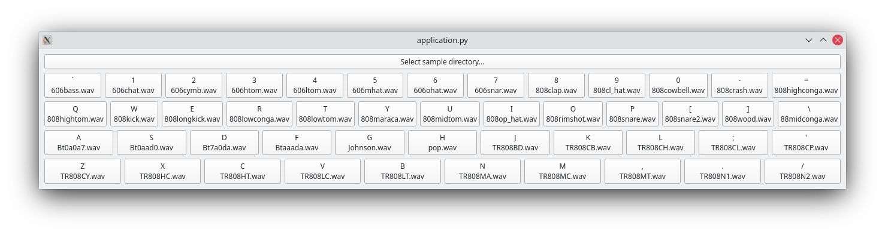

# quick-sampler

The quick sampler allows you to bind audio files (Wave only, at the moment) with
keyboard keys. 



It loads samples from a directory, searching in sub-folders for audio files.
Those samples are assigned to a give key. The sample name is displayed on
the virtual keyboard.

## Developer documentation

### Getting started

Bootstrap the development environment

```shell
source bootstrap.sh
```
